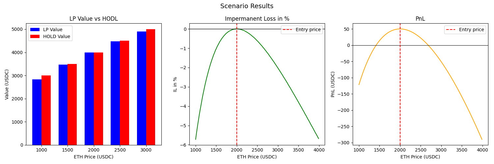

# Impermanent Loss & LP PnL 
## Research

**Impermanent loss** happens when you provide liquidity to a liquidity pool, and the price ratio between the assets you deposited changes compared 
to when you deposited them. 
The bigger this change, the more exposed you are to impermanent loss. This means that, at withdrawal, the dollar value of the assets 
you get back may be less than if you had simply held them outside the pool. 

A **liquidity pool** is a collection of cryptocurrencies or tokens locked in a smart contract that provides liquidity for decentralized trading, lending, and other financial activities.
The people who supply tokens to a pool are called **liquidity providers**, or **LPs**.
## Formulas

AMMs like Uniswap v2 use the **constant product formula**: $x \cdot y = k$ (where **x** is quantity of Token A, **y** is 
quantity of Token B and **k** is a constant).

To find **Impermanent Loss** we need to go through 5 steps:

#### Step 1: Define Initial State
* Initial quantities: x₀, y₀
* Initial price ratio:$p₀ = x₀/y₀$
* Invariant: $k = x₀ \cdot y₀$

#### Step 2: After Price Change
* New price ratio: p₁
* New quantities: x₁, y₁
* Still: $k = x₁ \cdot y₁$ and $p₁ = x₁/y₁$

#### Step 3: Solve for New Quantities From the equations above:
* $x₁ = \sqrt{k / p₁}$ and $y₁ = \sqrt{k \cdot p₁}$

#### Step 4: Calculate Values
* **LP position**: $V_{LP} = x₁ \cdot p₁ + y₁$
* **HODL position**: $V_{HODL} = x₀ \cdot p₁ + y₀$

#### Step 5: Calculate Impermanent Loss
* **Impermanent Loss in percents**: $IL_{perc} = \frac{V_{LP} - V_{HODL}}{V_{HODL}} \cdot 100\%$
* If you want you can also calculate **Price Ratio Change(d)**: $d = p₁/p₀$

After calculating IL, you can also calculate **PnL** for LP position: $PnL = V_{LP} + fees - V_{HODL}$

## Scenarios Table

**Here is values for 5 final price scenarios(1000, 1500, 2000, 2500, 3000), at the start LP adds 1 ETH + 2000 USDC and LP 
earned 50 USDC in fees**:

| Price (USDC) | ETH in pool | USDC in pool | LP | HODL | IL in % | PnL |
|------|------|------|------|------|------|------|
| 1000 | 1.4142 | 1414.21 | 2828.43 | 3000 | -5.72 | -121.57 |
| 1500 | 1.1547 | 1732.05 | 3464.10 | 3500 | -1.03 | 14.10 |
| 2000 | 1.0000 | 2000.00 | 4000.00 | 4000 | 0.00 | 50.00 |
| 2500 | 0.8944 | 2236.07 | 4472.14 | 4500 | -0.62 | 22.14 |
| 3000 | 0.8165 | 2449.49 | 4898.98 | 5000 | -2.02 | -51.02 |

## Charts and Visualizations

If you look at the charts, you can notice that impermanent loss (IL) isn’t really symmetric. In practice, when the price drops,
the loss tends to be more noticeable than when the price rises by a similar amount.

This mostly comes down to how price ratios work — they’re not linear. For example, a move from 2000 to 1000 is exactly a 2x change,
while going from 2000 to 3000 is only about 1.5x. So even if the absolute difference looks similar, the effect on IL is quite different.

At the same time, when price movements are small, IL is almost negligible and stays close to zero.

In the example with an entry price of 2000 USDC and 50 USDC earned in fees, the position stays profitable roughly between 1410
and 2680 USDC. Once the price moves outside of that range, the impermanent loss starts to outweigh the fees.

You can also check the interactive version of charts here: 
[🔗 Open Interactive Dashboard](https://ivantaborkikh.github.io/Impermanent-Loss-LP-PnL-/screenshots/charts_interactive.html)

## When is LP still profitable despite IL?
* **High fee income:** If the fees you earn are high enough, they can fully offset the losses. This usually
happens in pools with a lot of trading activity, where fees add up pretty quickly.
* **Low price volatility:** If the price doesn’t move much, the impermanent loss stays minimal.
* **Price returns to entry:** If the price moves around but eventually comes back near your entry point, the impermanent loss basically disappears.
Meanwhile, you still keep all the fees you earned during that time. That’s actually the reason it’s called “impermanent” —
the loss only becomes real if you withdraw at the wrong moment.
